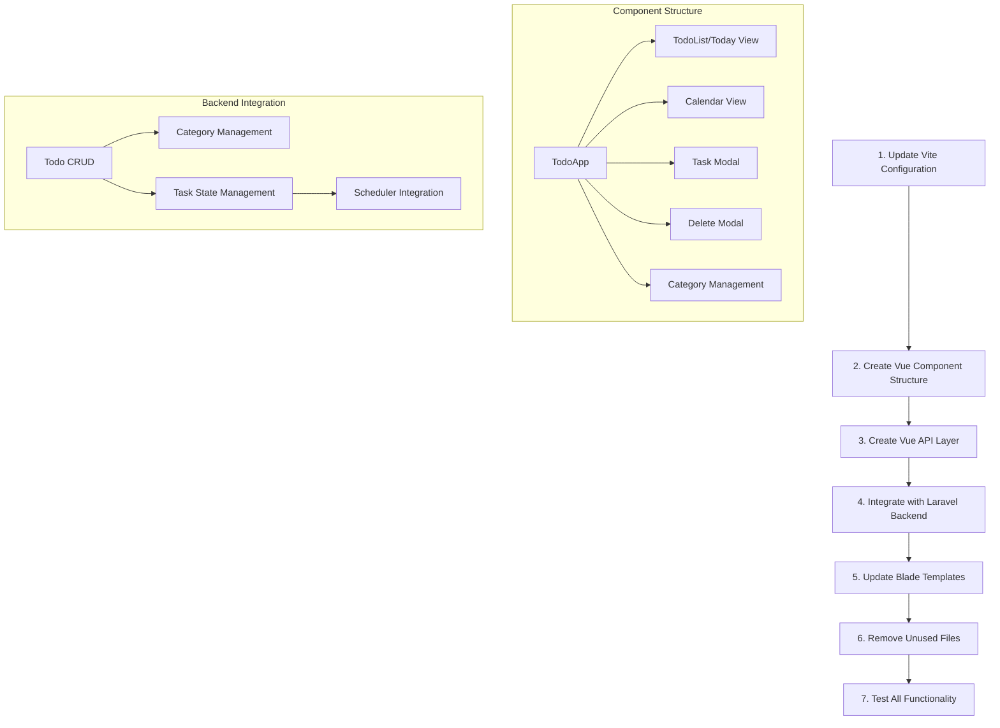

# Laravel Todo Application: Vue.js Migration Plan

## Overview

This document outlines the plan to migrate the current Todo application from JavaScript/AlpineJS to Vue.js while maintaining all existing functionality and UI appearance. We'll use Laravel 11, Tailwind CSS, and Vue.js to create a more maintainable and scalable frontend architecture.



## Detailed Migration Steps

### 1. Update Vite Configuration

Configure Vite to properly handle Vue.js components and integrate with Laravel:

```js
// vite.config.js
import { defineConfig } from "vite";
import laravel from "laravel-vite-plugin";
import vue from "@vitejs/plugin-vue";

export default defineConfig({
    plugins: [
        laravel({
            input: ["resources/css/app.css", "resources/js/app.js"],
            refresh: true,
        }),
        vue({
            template: {
                transformAssetUrls: {
                    base: null,
                    includeAbsolute: false,
                },
            },
        }),
    ],
    server: {
        host: "0.0.0.0",
        port: 3000,
        hmr: {
            host: "localhost",
        },
    },
});
```

### 2. Create Vue Component Structure

We'll create modular, reusable components:

#### Main Components

1. **TodoApp.vue** - Main container component that manages the overall app state

    - Handles routing between different views (today, date-specific, calendar)
    - Maintains global state

2. **TodoList.vue** - List view for tasks

    - Displays tasks for today or a specific date
    - Handles task filtering and sorting
    - Manages task status changes

3. **TodoCalendar.vue** - Calendar month view

    - Displays the month calendar with tasks
    - Handles navigation between months
    - Shows task counts per day

4. **TaskModal.vue** - Add/edit task modal

    - Form for creating and editing tasks
    - Supports recurring task creation
    - Handles category selection
    - Validates input

5. **DeleteConfirmModal.vue** - Confirmation dialog

    - Confirms task deletion
    - Handles recurring task deletion options

6. **CategoryManagement.vue** - Category handling
    - Allows creating and selecting categories
    - Manages category colors

#### Supporting Components

1. **TaskItem.vue** - Individual task display

    - Shows task details
    - Handles completion toggle
    - Displays category information

2. **CalendarCell.vue** - Calendar day cell

    - Shows date and related tasks
    - Handles day selection

3. **CategorySelector.vue** - Category selection

    - Dropdown for selecting categories
    - Interface for creating new categories

4. **NotificationComponent.vue** - Notifications
    - Displays success/error messages
    - Automatically disappears after timeout

### 3. Create Vue API Layer

Build a service layer to communicate with the Laravel backend:

```js
// resources/js/api/todo.js
import axios from 'axios';

export default {
    // Get tasks based on view and date
    getTasks(view, date) {
        return axios.get(`/api/todos`, { params: { view, date } });
    },

    // Create new task
    createTask(taskData) {
        return axios.post('/api/todos', taskData);
    },

    // Update existing task
    updateTask(id, taskData) {
        return axios.put(`/api/todos/${id}`, taskData);
    },

    // Toggle task completion
    toggleTask(id) {
        return axios.patch(`/api/todos/${id}/toggle`);
    },

    // Move task to trash
    trashTask(id) {
        return axios.patch(`/api/todos/${id}/trash`);
    },

    // Restore task from trash
    restoreTask(id) {
        return axios.patch(`/api/todos/${id}/restore`);
    },

    // Delete task permanently
    deleteTask(id, deleteRecurring = false) {
        return axios.delete(`/api/todos/${id}`, {
            params: { delete_recurring: deleteRecurring ? 1 : 0 }
        });
    },

    // Empty trash
    emptyTrash() {
        return axios.delete('/api/todos/trash/empty');
    },

    // Get trashed tasks
    getTrashedTasks() {
        return axios.get('/api/todos/trash');
    }
}

// resources/js/api/category.js
import axios from 'axios';

export default {
    // Get all categories
    getCategories() {
        return axios.get('/api/categories');
    },

    // Create new category
    createCategory(categoryData) {
        return axios.post('/api/categories', categoryData);
    },

    // Update category
    updateCategory(id, categoryData) {
        return axios.put(`/api/categories/${id}`, categoryData);
    },

    // Delete category
    deleteCategory(id) {
        return axios.delete(`/api/categories/${id}`);
    }
}
```

### 4. Backend Integration

#### API Routes

We'll need to create API endpoints for Vue.js to communicate with:

```php
// routes/api.php
Route::middleware('auth:sanctum')->group(function () {
    Route::get('/todos', [TodoApiController::class, 'index']);
    Route::post('/todos', [TodoApiController::class, 'store']);
    Route::put('/todos/{todo}', [TodoApiController::class, 'update']);
    Route::patch('/todos/{todo}/toggle', [TodoApiController::class, 'toggle']);
    Route::patch('/todos/{todo}/trash', [TodoApiController::class, 'trash']);
    Route::patch('/todos/{todo}/restore', [TodoApiController::class, 'restore']);
    Route::delete('/todos/{todo}', [TodoApiController::class, 'destroy']);
    Route::delete('/todos/trash/empty', [TodoApiController::class, 'emptyTrash']);
    Route::get('/todos/trash', [TodoApiController::class, 'trashed']);

    Route::get('/categories', [CategoryApiController::class, 'index']);
    Route::post('/categories', [CategoryApiController::class, 'store']);
    Route::put('/categories/{category}', [CategoryApiController::class, 'update']);
    Route::delete('/categories/{category}', [CategoryApiController::class, 'destroy']);
});
```

#### Scheduler Integration

The scheduler functionality must work harmoniously with the Vue.js frontend:

-   Ensure Vue properly refreshes data after scheduler runs
-   Create appropriate state handling for tasks modified by the scheduler
-   Handle notifications for reminders sent by scheduled commands

### 5. Update Blade Templates

Replace Alpine.js with Vue mounting points:

```html
<!-- resources/views/todos/index.blade.php -->
<x-app-layout>
    <div
        id="todo-app"
        data-initial-view="{{ $view }}"
        data-initial-date="{{ $date->format('Y-m-d') }}"
    ></div>
</x-app-layout>
```

### 6. Update Main Entry Point

Update the main JavaScript entry point to mount Vue:

```js
// resources/js/app.js
import "./bootstrap";
import { createApp } from "vue";
import TodoApp from "./components/TodoApp.vue";

// Mount the Vue application
const app = createApp(TodoApp);

// Register any global components or plugins here
app.mount("#todo-app");
```

### 7. Remove Unused Files

Files that will no longer be needed after migration:

-   AlpineJS-specific code
-   Inline JavaScript in Blade templates
-   Old JavaScript handlers

### 8. Testing

Thoroughly test all functionality:

-   Task creation, editing, deletion
-   Calendar navigation
-   Category management
-   Trash functionality
-   Recurring tasks
-   Scheduler integration

## Components in Detail

### TodoApp.vue (Main Container)

```vue
<template>
    <div class="max-w-6xl mx-auto p-4">
        <!-- Navigation and header -->
        <div class="flex justify-between items-center mb-4">
            <!-- View-specific headers -->
            <div v-if="currentView === 'calendar'">
                <!-- Calendar navigation -->
                <calendar-navigation
                    :current-date="currentDate"
                    @prev-month="navigateToPrevMonth"
                    @next-month="navigateToNextMonth"
                />
            </div>
            <div v-else-if="currentView === 'date' || currentView === 'today'">
                <!-- Date navigation -->
                <date-navigation
                    :current-date="currentDate"
                    :view="currentView"
                    @prev-day="navigateToPrevDay"
                    @next-day="navigateToNextDay"
                />
            </div>

            <!-- Add task button -->
            <button
                v-if="isAuthenticated"
                @click="openTaskModal('add')"
                class="px-4 py-2 bg-blue-600 text-white rounded-md shadow-sm hover:bg-blue-700 transition-colors flex items-center"
            >
                <svg
                    class="h-4 w-4 mr-1"
                    fill="none"
                    viewBox="0 0 24 24"
                    stroke="currentColor"
                >
                    <path
                        stroke-linecap="round"
                        stroke-linejoin="round"
                        stroke-width="2"
                        d="M12 4v16m8-8H4"
                    />
                </svg>
                タスクを追加
            </button>
        </div>

        <!-- Main content area -->
        <todo-calendar
            v-if="currentView === 'calendar'"
            :date="currentDate"
            :todos="todos"
            @edit-todo="editTodo"
            @day-selected="selectDay"
        />
        <todo-list
            v-else
            :date="currentDate"
            :todos="todos"
            :view="currentView"
            @toggle-todo="toggleTodo"
            @trash-todo="trashTodo"
            @edit-todo="editTodo"
        />

        <!-- Modals -->
        <task-modal
            v-if="isTaskModalOpen"
            :mode="taskModalMode"
            :todo-id="selectedTodoId"
            :todo-data="selectedTodoData"
            :categories="categories"
            :current-date="currentDate"
            :current-view="currentView"
            @close="closeTaskModal"
            @submit="submitTask"
            @delete="confirmDelete"
        />

        <delete-confirm-modal
            v-if="isDeleteModalOpen"
            :todo-title="selectedTodoData?.title"
            :is-recurring="isRecurringDeletion"
            @confirm="deleteTask"
            @cancel="closeDeleteModal"
        />

        <!-- Notification component -->
        <notification-component ref="notification" />
    </div>
</template>
```

### Key Features to Implement

1. **Data Reactivity**

    - Vue's reactivity system will automatically update the UI when data changes
    - State will be centralized in the TodoApp component

2. **Reusable Components**

    - Break down complex UI into smaller, reusable components
    - Maintain consistent design throughout the app

3. **API Service Layer**

    - Abstract API calls from components
    - Handle errors and loading states consistently

4. **Scheduler-Related Features**
    - Support for showing tasks affected by the scheduler
    - Display appropriate state transitions
    - Handle notifications for reminders

## Timeline and Implementation Strategy

1. Setup Vue and Vite configuration
2. Create basic component structure
3. Implement API service layer
4. Develop one view at a time:
    - Start with TodoList view
    - Add TaskModal functionality
    - Implement Calendar view
    - Add Category management
5. Test and refine each component
6. Final integration and testing

## Conclusion

This migration to Vue.js will provide several benefits:

-   More maintainable code structure
-   Better component reusability
-   Improved state management
-   Enhanced performance
-   Better developer experience

All existing functionality including the scheduler will be preserved with the same look and feel, but with cleaner, more maintainable code.
